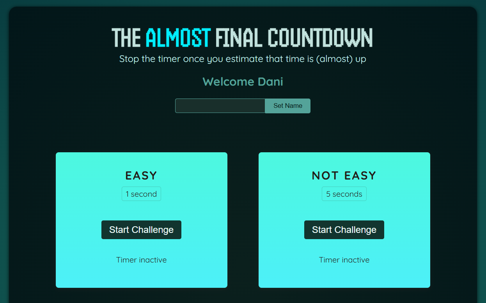
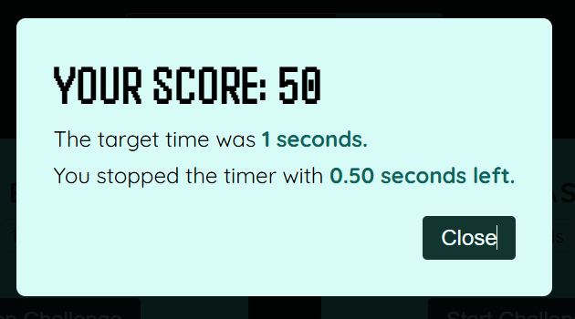

# The almost final countdown game

This is a small project developed with React. It's a game where the objective is to stop the timer as close to the target time as possible. The closer the user is to the target, the higher their score.

## Table of contents

- [Overview](#overview)
  - [Screenshot](#screenshot)
- [My process](#my-process)
  - [Built with](#built-with)
  - [What I learned](#what-i-learned)
  - [Continued development](#continued-development)
  - [Useful resources](#useful-resources)
- [Author](#author)
- [Acknowledgments](#acknowledgments)

## Overview

### Screenshot





## My process

### Built with

- React
- CSS custom properties
- CSS Flex box

### What I learned

"While working on this project, I gained valuable experience in creating a portal for modals, which ensures that modals render outside the main DOM hierarchy. Additionally, I effectively utilized advanced React hooks such as forwardRef, useImperativeHandle, and useRef. These tools allowed me to manage references and component instances more efficiently, thereby creating a more responsive and dynamic user interface.

```js
const ResultModal = forwardRef(function ResultModal(
  { targetTime, remainingTime, onReset },
  ref
) {
  const dialog = useRef();

  const userLost = remainingTime <= 0;
  const formattedRemainingTime = (remainingTime / 1000).toFixed(2);
  const score = Math.round((1 - remainingTime / (targetTime * 1000)) * 100);

  useImperativeHandle(ref, () => {
    return {
      open() {
        dialog.current.showModal();
      },
    };
  });
});
```

### Continued development

My goal is to further enhance my understanding of React hooks and custom hooks as I develop the app and ensure seamless integration with the backend.

### Useful resources

- [Example resource 1](https://www.udemy.com) - I developed this small application through the course Dive in and learn React.js from scratch! by Maximilian Schwarzmüller - Udemy.

## Author

- Website - [Daniela Serrano](https://github.com/danielaser)

## Acknowledgments

As a junior developer, I found the Udemy course Dive in and Learn React.js from Scratch! by Maximilian Schwarzmüller to be incredibly valuable. It has helped me create cleaner React applications and gain a better understanding of key concepts.
